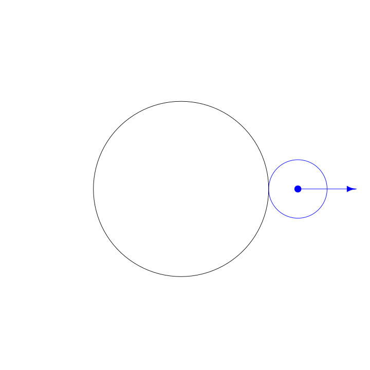

class: middle, center, inverse


```{css, echo=FALSE}
body {
  background-color: white;
}

.row {
  overflow: hidden;
}

div.remark-slide-number {
  display: none;
}

div.col-7 {
  padding: 0;
  margin: 0;
  overflow: hidden;

}

div.col-7 object {
  padding: 0;
  margin: 0;
  overflow: hidden;
  min-height: 100%;
  min-width: 100%;
  width: auto;
  height: auto;
  max-width: none;
  max-height: none;
  display: block;
  position: relative;
  top: 50%;
  left: 50%;
  transform: translate(-50%, -50%);
}

.row {
  padding: 0;
  margin: 0;
}

```


```{r setup, include=FALSE}
options(htmltools.dir.version = FALSE)
knitr::opts_chunk$set(echo = F, eval = F, comment = "")
library(tidyverse)
```

```{r xaringan-themer, include=FALSE, warning=FALSE}
library(xaringanthemer)
style_mono_light(base_color = "#23395b", background_color = "#FFFFFF")
```

# Welcome to my gallery

# of digital spirographs!

---
class: middle

.pull-left[
A spirograph is made by tracing a circle inside another circle, like this:


]

--

.pull-right[
You can also make a spirograph by tracing a circle outside other circle like this:


]

---
class: center, middle, inverse

## I used software my dad wrote to make this gallery of

## ~~animated digital spirographs~~ 

## Tobin-SchneiderGraphs.

I hope you like it.

---
class: m-0, p-0

.row[
.col-5[

.m-4[

# Traveling Cats

For this I put two spirographs together and spun them in different directions. This gave the intersecting lines the illusion that they are moving. 

Press the **Start** button to see the "cats" travel.

]
]

.col-7[
<object data="traveling_cat.svg" type="image/svg+xml" />
]
]


---
class: m-0, p-0

.row[
.col-5[

.m-4[

# Shimmering Tendrils

What happens when you make 15 copies of the same spirograph and spin them at different speeds? 

Press the **Start** button to be bedazzled!

]
]

.col-7[
<object data="shimmering_tendrils.svg" type="image/svg+xml" />
]
]

---
class: m-0, p-0

.row[
.col-5[

.m-4[

#  Greed of the Colony

The greed of this spirograph is insurmountable. It will suck you in. 

Press **Start** if you dare!

]
]

.col-7[
<object data="colony_greed.svg" type="image/svg+xml" />
]
]


---
class: m-0, p-0

.row[
.col-5[

.m-4[

# Internal Wave

Don't let its summer-like look fool you. Like the Colony, it has big ambitions&mdash;like the end of poverty, the start of world peace, and the return of Toys 'R Us.

Press **Start** to change the world.

]
]

.col-7[
<object data="internal_wave.svg" type="image/svg+xml" />
]
]


---
class: m-0, p-0

.row[
.col-5[

.m-4[

# Neon Bagel Tunnel

This one does not move. It just sits there...like a bagel...but neon...in a tunnel. 

Yeah, that makes sense.

]
]

.col-7[
<object data="neon_bagel_tunnel.svg" type="image/svg+xml" />

]
]

---
class: m-0, p-0

.row[
.col-5[

.m-4[

# Perplexed Spartan

If only he was right in the head. *If*.
]
]

.col-7[

<object data="dizzy_roman.svg" type="image/svg+xml" />
]
]


---
class: m-0, p-0

.row[
.col-5[

.m-4[

# I'll Tell You All About It When I See You Again...

(Any resemblance to Neon Bagel Tunnel is purely coincidental. Literally coincidental.)

]
]

.col-7[
<object data="when_i_see_you_again.svg" type="image/svg+xml" />
]
]
