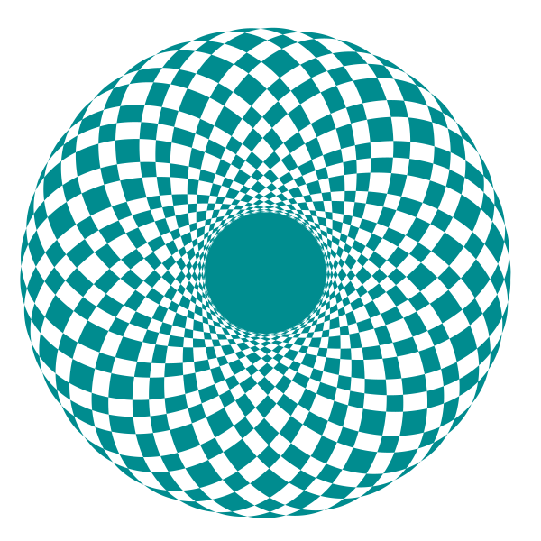
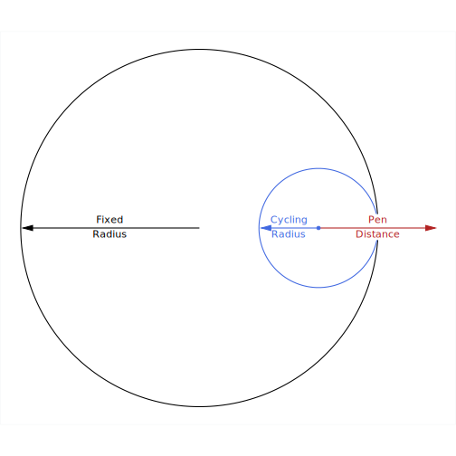

class: split-square2, dark

```{r setup, include=FALSE}

knitr::opts_chunk$set(echo = T, eval = F, cache = F, dev = "svg")
library(extrafont)
loadfonts("win")
loadfonts("pdf")
# extrafont::ttf_import(paths = "C:/USERS/RENEE/APPDATA/LOCAL/MICROSOFT/WINDOWS/FONTS")
remake = FALSE

  
library(spiro)
library(tidyverse)
library(LaCroixColoR)
library(scico)
library(dutchmasters)
library(ochRe)
library(scales)

myfont <- "Cormorant"
update_geom_defaults("text", list(family = myfont))
update_geom_defaults("label", list(family = myfont))


bg_light <- "#f0f2f5"
bg_dark <- "#282829"
```


```{r xaringan-tile-view, echo=FALSE, eval=TRUE}
library(xaringanExtra)
xaringanExtra::use_tile_view()
```


```{r share-again, echo=FALSE, eval=TRUE}
xaringanExtra::use_share_again()
xaringanExtra::style_share_again(share_buttons = "all")
```

```{r style-share-again, echo=FALSE, eval=TRUE}
xaringanExtra::style_share_again(
  share_buttons = c("all")
)
```

.column.right[
.vmiddle[

# Schneirographs

## Three Numbers & One Equation

## by W. Joel Schneider

]
]

.column.p-4[
<!--  --> 

<!--  --> 
]

---
class: split-square2, dark

.fixed-bottom.left.p-4.w-1.light[Press `f` on your keyboard to see in full screen mode. Press `o` to see an overview of all the slides. To see the code that generated each spirograph, press `p`. Other commands can be seen by pressing `h` for help.]

.column.light[
.vmiddle.center[
# Welcome,
# Everyone!
]
]

.column[
<!--  --> 

<!--  --> 
]

???


```{r, echo=TRUE}
library(spiro)
library(tidyverse)
library(LaCroixColoR)
library(scico)
library(dutchmasters)
library(ochRe)
library(scales)

myfont <- "Cormorant"
bg_light <- "#f0f2f5"
bg_dark <- "#282829"

spiro(
  fixed_radius = 1231,
  cycling_radius = 529,
  pen_radius = 1233, 
  colors = viridis::viridis(67),
  color_groups = 67,
  color_cycles = 59,
  windings = 96,
  points_per_polygon = 50,
  file = "viridis_weave.svg"
) %>%
  add_background(color = bg_dark)
```

---
class: middle, left, split-three


.column.font2.p-2.light[.vmiddle.center[
As a kid,  
I *loved* making  
spirographs.  
I still do. 
]]

.column.font2.p-2.dark[.vmiddle.center[
Making them  
feels more like  
discovery  
than creativity,  
like finding  
hidden wings  
in the  
Mathematical  
Museum of Art.
]]

.column.font2.p-2.light[.vmiddle.center[
I have not yet  
found the point  
where spirographs  
no longer surprise. 
]
]
---
class: split-square2

.column.dark[
.vmiddle.p-4[
  The surprising variety of forms generated by spirographs are manifestations of just one equation, the [circular path troichoid](https://www.wikiwand.com/en/Hypotrochoid). The shape of the spirograph depends on the radius of a fixed circle, radius of a cycling circle, and the distance of the pen from the center of the the cycling circle.
  

$$
\begin{align}
x (\theta) &= (R - r)\cos\theta + d\cos\left({R - r \over r}\theta\right)\\
y (\theta) &= (R - r)\sin\theta - d\sin\left({R - r \over r}\theta\right)
\end{align}
$$

* *R* is the radius of the fixed circle  
* *r* is the radius of the cycling circle  
* *d* is the distance of the pen from the center of the cycling circle  
* *&theta;* is the number of radians the cycling circle travels around the fixed circle  
* *x*(*&theta;*) is the position of *x* after the cycling circle travels *&theta;* radians  
* *y*(*&theta;*) is the position of *y* after the cycling circle travels *&theta;* radians

]
]
.column[
<!--  --> 

<!--  --> 

???

```{r spiro_parameters, fig.cap="Three parameters of spirograph shapes", fig.height=7, fig.width=7, message=FALSE, warning=FALSE, out.height='100%', out.width='100%'}
cycling_radius <- 1 
fixed_radius <- 3
pen_radius <- 2

d_circle <- tibble(
  x0 = c(0, fixed_radius - cycling_radius),
  y0 = c(0, 0),
  radius = c(fixed_radius, cycling_radius),
  r_y = c(0, 0),
  r_x = c(-fixed_radius / 2, fixed_radius - 1.5 * cycling_radius),
  r_lab = c("Fixed\nRadius", "Cycling\nRadius"),
  color = c("black", "royalblue")
)

d_segment <- tibble(
  x = c(0, fixed_radius - cycling_radius, fixed_radius - cycling_radius),
  y = c(0, 0, 0),
  xend = c(-fixed_radius + 0.04, fixed_radius - cycling_radius * 2 + 0.04, fixed_radius - cycling_radius + pen_radius - 0.04),
  yend = c(0, 0, 0),
  color = c("black", "royalblue", "firebrick")
)

ggplot(data = d_circle) +
  theme_void() +
  ggforce::geom_circle(
    aes(
      x0 = x0,
      y0 = y0,
      r = radius,
      color = color),
    n = 1000) +
  coord_equal() +
  geom_text(
    aes(
      x = r_x,
      y = r_y,
      label = r_lab,
      color = color),
    family = myfont,
    vjust = 0.5,
    nudge_y = 0.015,
    angle = 0) +
  annotate(
    x = fixed_radius - cycling_radius + pen_radius / 2,
    y = 0.015,
    geom = "label",
    family = myfont,
    color = "firebrick",
    label = "Pen\nDistance",
    label.size = 0,
    label.padding = unit(3, "pt")) +
  geom_segment(
    data = d_segment,
    aes(x = x, y = y, xend = xend, yend = yend, color = color),
    geom = "segment",
    linejoin = "mitre",
    arrow = arrow(
      length = unit(0.025, "npc"),
      type = "closed",
      angle = 15)) +
  annotate(
    x = fixed_radius - cycling_radius,
    y = 0,
    geom = "point",
    color = "royalblue") +
  scale_color_identity() +
  theme(legend.position = "none", plot.background = element_rect(colour = "#f0f2f5"))

ggsave("spiro_parameters.svg", width = 7, height = 7)
```

]

---
class: split-square1, dark

.column.bg-white[

]

.column.dark[
.vmiddle.font2.pl-5.pr-0.ml-3[
In this spirograph,<br>the fixed radius *R* is 3,<br>the cycling radius *r* is 1,<br>and the pen radius *d* is 2.
]
]

---
class: split-square2

.column.dark[
.vmiddle.font2.p-5.pr-0.m-2[
Setting the cycling radius
to a negative value will
make the cycling circle
rotate around the outside
of the fixed circle.
]
]


.column[

]


---
class: split-square2, dark

.column.light[.vmiddle.p-5.font_large[
Although I still like making spirographs by hand, I wanted to extend what could be done with the traditional spirograph. I wrote the [spiro ](https://wjschne.github.io/spiro/articles/HowToUse/spiro.html) package in R to make images that would be impossible to create on paper.
]]

.column.dark.font-medium[.vmiddle.p-5.font_large[
I cannot usually predict what will happen when I play with the three primary numbers of the equation. However, once a certain combination strikes me as interesting, I play with cutting it into different color segments to see if something of further interest happens. Sometimes I merge many spirographs and spin them to see if the emerging patterns are pleasing. 
]]

---
class: middle, split-square1, dark

.column.light.font3.center[.vmiddle.p-5[
Here I demonstrate what can be done with [spiro ](https://wjschne.github.io/spiro/articles/HowToUse/spirograph.html) package. 
]]

.column.dark.font3.center[.vmiddle.p-5[
I would love to see what you can do with it.
]]

---
class: split-square1

.column[
<!--  --> 

<!--  --> 
]

.column.p-2.light[
.vmiddle.center[

# My Non-
# Canonical
# Backstory

]
]

???

```{r, eval=remake}
k <- 8
crossing(cycling_radius = 1:k, fixed_radius = k * 2 + 1) %>%
  rowid_to_column("id") %>%
  mutate(
    colors = lacroix_palette("Coconut", n = k , "continuous"),
    file = paste0("sdfds.", id, ".svg")
  ) %>%
  select(-id) %>%
  pmap(
    spiro,
    points_per_polygon = 300,
    draw_fills = F,
    transparency = 0.9) %>%
  image_merge(
    output = "my_non_canonical_backstory.svg") %>%
  add_background()
```


<script src="myjs.js"></script>

